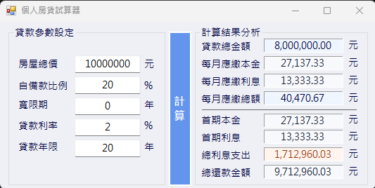

# HomeLoanCalculator 個人房貸計算器
這是一個簡單的個人房貸計算器，它可以幫助你計算每月還款金額、總還款金額以及總利息。
## 使用方法
1. 輸入房屋總價。
2. 輸入自備款比例。
3. 輸入寬限期。
4. 輸入貸款利率。
5. 輸入貸款年限。
6. 點擊「計算」按鈕，即可看到每月還款金額、總還款金額和總利息。
```
備註：
可以使用tab鍵進行輸入，有調整好tableindex。
```
## 計算公式
依照內政部房貸試算標準，採用等額本息攤還方式：
```
月利率 r = 年利率 ÷ 12
每月應繳 = P × r × (1+r)^n / [(1+r)^n - 1]
```
- P：貸款本金
- r：月利率
- n：攤還月數（總月數 - 寬限期月數）

寬限期間內每月僅繳利息，不還本金。

## 輸入驗證
| 欄位 | 驗證條件 | 錯誤原因 |
| -------- | -------- | -------- |
| 房屋總價     | 正整數，範圍 1 ~ 1,000,000,000     | 避免負數、零值與不合理天文數字     |
| 自備款比例     | 0.01 ~ 99.99，最多小數兩位     | 0% 代表全額貸款不合理，100% 代表不需貸款     |
| 貸款利率     | 0.01 ~ 30.00，最多小數兩位     | 利率為 0 無意義，超過 30% 超出正常房貸範圍     |
| 貸款年限     | 正整數，範圍 1 ~ 40     | 台灣房貸最長以 40 年為上限     |
| 寬限期     | 非負整數，且必須小於貸款年限     | 寬限期不可超過還款期間     |

```輸入不合法時會跳出警告視窗，程式不會因錯誤輸入而崩潰。```

## 參考資料
- [內政部不動產資訊平台](https://pip.moi.gov.tw/Publicize/Info/C1040)
- [中國信託房貸月付金試算](https://www.ctbcbank.com/content/dam/minisite/long/loan/mortgage/cal01.html)


